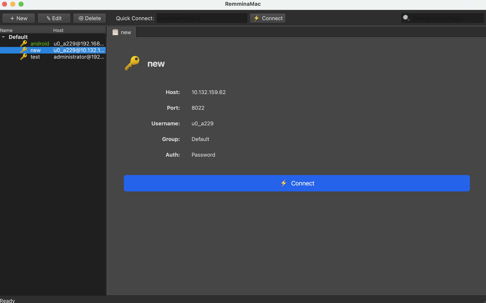

# sshelf

A Remmina-inspired SSH connection manager for macOS, Linux, and Windows, built with Python and PyQt6.



## Features

### Connection management
- Connections organized into groups with drag-and-drop reordering
- Per-connection settings: port, username, password, SSH key + passphrase, jump host, startup command, color tag, notes
- Quick-connect bar for one-shot connections (`user@host:port`)
- Search/filter connections in real time
- Import connections directly from `~/.ssh/config` (File → Import from ~/.ssh/config…)
- **Command Palette** (`Cmd+P`) — fuzzy search over all connections and app commands; open any session in one keystroke

### Terminal
- Multi-tab terminal — open multiple SSH sessions simultaneously; each connection gets its own tab
- **Split panes** — click ⊞ to open a second SSH session to the same host side by side
- Full VT100/xterm-256color support — vim, htop, less, nano all work correctly
- Alt-screen programs (vim, htop) render cleanly with no frame stacking
- Dynamic PTY resize — terminal columns/rows follow the window size automatically
- Copy: select text then `Cmd+C` or right-click → Copy
- Paste: `Cmd+V` or right-click → Paste
- Font zoom: `Cmd+=` / `Cmd++` increase, `Cmd+-` decrease, `Cmd+0` reset; **zoom level is remembered per connection**
- **Terminal search** — `Ctrl+F` inline search bar with previous/next navigation
- **Session logging** — toggle ⏺ to write ANSI-stripped plain text to `logs/`
- **Auto-reconnect** — red bar with ↺ button appears on unexpected disconnect
- Tab color matches the connection's assigned color for quick visual identification
- Session end (typing `exit`) closes the tab automatically

### Command snippets
- Save frequently used commands globally or per-connection
- Click any snippet in the ⚡ side panel to send it instantly

### SFTP file browser
- Built-in 📁 side panel — browse the remote filesystem, download, or upload files
- Auto-connects on the existing SSH session (no second login needed)

### Terminal color themes
- Five built-in themes: **One Dark**, **Dracula**, **Solarized Dark**, **Nord**, **Gruvbox Dark**
- Switch themes in Preferences — applied live to all open terminals

### SSH key management
- Generate new SSH key pairs from File → Generate SSH Key…
- Supports ed25519, ECDSA (256/384/521), RSA-2048 and RSA-4096
- One-click copy of public key or `ssh-copy-id` command

### Port forwarding
- Define local and remote tunnels per connection in the 🔀 side panel
- Tunnels start automatically when the SSH session connects

### Security
- Passwords stored in the **OS keychain** via the `keyring` library — never written to disk in plaintext
  - macOS: Keychain Access
  - Linux: GNOME Keyring / KWallet (via SecretService; requires `secretstorage`)
  - Windows: Windows Credential Manager
  - Falls back to SQLite if no keychain backend is available
- SSH key authentication with optional passphrase
- Jump host (ProxyJump) support

### UI / UX
- Single-click a connection → shows detail panel in the Home tab without disturbing active terminals
- Double-click a connection → opens or switches to its terminal tab
- **Detachable tabs** — right-click any tab → Open in New Window
- **macOS menu bar icon** — quick access to recent connections, quick connect, and quit
- **Fullscreen mode** — `Cmd+Enter` hides all chrome and goes fullscreen
- **Broadcast input** — 📡 toolbar button sends keystrokes to all open terminal panes simultaneously
- Light / Dark / System theme switching (Preferences)
- Window geometry persisted across launches

## Requirements

- macOS 11+, Linux, or Windows 10+
- Python 3.10+

Python dependencies (installed via `pip install -r requirements.txt`):

| Package | Version |
|---------|---------|
| PyQt6 | >= 6.4.0 |
| paramiko | >= 3.3.0 |
| pyte | >= 0.8.0 |
| cryptography | >= 41.0.0 |
| keyring | >= 24.0.0 |

## Installation

### One-line install (macOS and Linux)

```bash
curl -sSL https://raw.githubusercontent.com/georgegozal/sshelf/main/install.sh | bash
```

Clones the repo to `~/.local/share/sshelf`, creates a venv, installs dependencies, and puts a `sshelf` launcher in `~/.local/bin`. On Linux it also creates a `.desktop` file so sshelf appears in your application menu.

To uninstall:

```bash
curl -sSL https://raw.githubusercontent.com/georgegozal/sshelf/main/uninstall.sh | bash
```

### Install (Windows)

Open PowerShell and run:

```powershell
iwr https://raw.githubusercontent.com/georgegozal/sshelf/main/install.ps1 -OutFile install.ps1
powershell -ExecutionPolicy Bypass -File install.ps1
```

Clones the repo to `%LOCALAPPDATA%\sshelf`, creates a venv, installs dependencies, and creates a `sshelf.bat` launcher. Optionally adds the install directory to your user PATH.

To uninstall:

```powershell
iwr https://raw.githubusercontent.com/georgegozal/sshelf/main/uninstall.ps1 -OutFile uninstall.ps1
powershell -ExecutionPolicy Bypass -File uninstall.ps1
```

### Manual install

```bash
python3 -m venv .venv
source .venv/bin/activate
pip install -r requirements.txt
```

## Run

```bash
source .venv/bin/activate
python main.py
```

### CLI options

| Flag | Description |
|------|-------------|
| `-n NAME`, `--name NAME` | Append a custom label to the window title (e.g. `--name Work`) |
| `-u`, `--upgrade` | Pull the latest version from GitHub and update dependencies, then exit |

Examples:

```bash
python main.py --name "Work"       # title becomes "sshelf — Work"
python main.py --upgrade           # update in-place and exit
```

## Keyboard shortcuts

| Shortcut | Action |
|----------|--------|
| `Cmd+P` | Open command palette |
| `Cmd+N` | New connection |
| `Cmd+E` | Edit selected connection |
| `Cmd+Backspace` | Delete selected connection |
| `Cmd+Shift+Q` | Focus quick-connect bar |
| `Cmd+Shift+L` | Toggle connection list panel |
| `Cmd+,` | Preferences |
| `Cmd+Enter` | Toggle fullscreen |
| `Cmd+W` | Close current tab |
| `Cmd+1` – `Cmd+9` | Switch to tab by position |
| `Cmd+Q` | Quit |
| `Cmd+C` / `Ctrl+Shift+C` | Copy terminal selection |
| `Cmd+V` / `Ctrl+Shift+V` | Paste to terminal |
| `Cmd+=` / `Cmd++` | Increase terminal font size |
| `Cmd+-` | Decrease terminal font size |
| `Cmd+0` | Reset terminal font size |
| `Ctrl+F` | Open inline search bar |
| `Ctrl+C` | Send SIGINT (`\x03`) to remote process |

## Project structure

```
sshelf/
├── main.py                          Entry point — creates QApplication, Database, MainWindow
├── requirements.txt
├── install.sh                       One-line installer (macOS + Linux)
├── uninstall.sh                     Uninstaller (macOS + Linux)
├── install.ps1                      One-line installer (Windows)
├── uninstall.ps1                    Uninstaller (Windows)
├── docs/                            Detailed documentation
│   ├── architecture.md
│   ├── terminal-internals.md
│   ├── security.md
│   └── development.md
└── src/
    ├── app.py                       QApplication subclass — theme management
    ├── models/
    │   ├── connection.py            Connection dataclass + to_dict / from_dict
    │   └── tunnel.py                Tunnel dataclass (port-forwarding rules)
    ├── storage/
    │   ├── database.py              SQLite persistence (connections, preferences, snippets, tunnels)
    │   └── keychain.py              OS keychain wrapper (macOS Keychain / GNOME Keyring / Win Credential Manager)
    ├── protocols/
    │   ├── base.py                  Abstract base for protocol workers
    │   ├── ssh.py                   SSHWorker: paramiko in a QThread
    │   └── tunnel_worker.py         LocalTunnelWorker + RemoteTunnelWorker
    └── ui/
        ├── main_window.py           Main window + tab manager + tray icon + broadcast
        ├── connection_tree.py       Left panel: grouped connection list + health dots
        ├── connection_dialog.py     Add / edit connection dialog
        ├── terminal_widget.py       Embedded VT100 terminal (pyte + QPlainTextEdit)
        ├── split_view.py            Horizontal split container for multiple terminal panes
        ├── command_palette.py       Cmd+P fuzzy-search command palette
        ├── welcome_widget.py        Home tab: welcome screen + connection detail
        ├── preferences_dialog.py    App preferences (theme, icon theme, terminal theme)
        ├── ssh_config_import_dialog.py  ~/.ssh/config import UI
        ├── snippets_panel.py        Command snippets side panel
        ├── sftp_panel.py            SFTP file browser side panel
        ├── tunnel_panel.py          Port-forwarding side panel
        ├── themes.py                Built-in terminal color themes
        └── key_gen_dialog.py        SSH key pair generation dialog
```

## Data storage

| Data | Location |
|------|----------|
| Connection metadata (macOS) | `~/Library/Application Support/sshelf/connections.db` |
| Connection metadata (Linux) | `~/.local/share/sshelf/connections.db` |
| Connection metadata (Windows) | `%APPDATA%\sshelf\connections.db` |
| Passwords & passphrases | OS keychain (service: `sshelf`) — see Security section |
| Preferences | Same SQLite database, `preferences` table |
| Snippets | Same SQLite database, `snippets` table |
| Tunnel rules | Same SQLite database, `tunnels` table |

## Documentation

Detailed documentation lives in the [`docs/`](docs/) folder:

| Document | Contents |
|----------|----------|
| [architecture.md](docs/architecture.md) | Layer overview, data flow, key design decisions |
| [terminal-internals.md](docs/terminal-internals.md) | pyte integration, rendering strategy, keyboard handling |
| [security.md](docs/security.md) | Keychain storage, SSH auth, known limitations |
| [development.md](docs/development.md) | Dev setup, adding fields/protocols, debugging tips |

## License

sshelf is free software released under the **GNU General Public License v3.0**.
See [LICENSE](LICENSE) for the full text.
